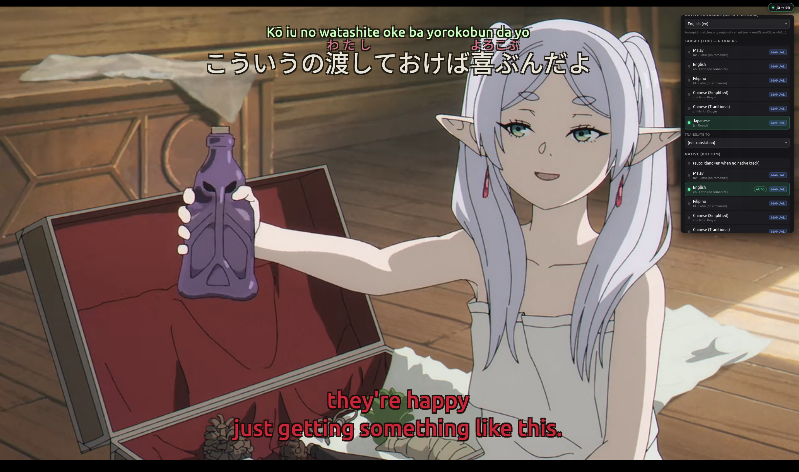
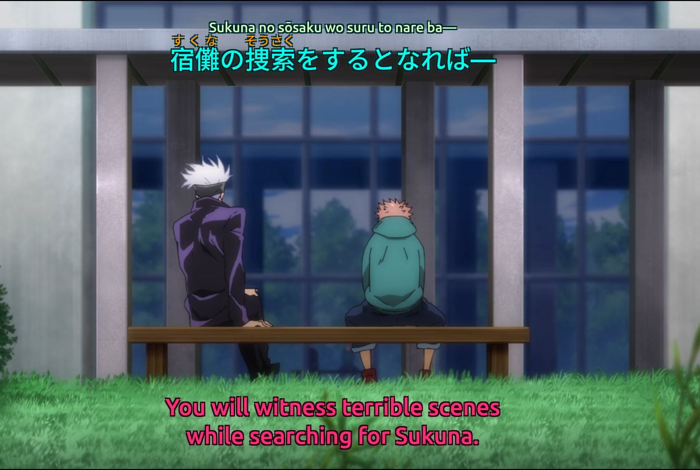
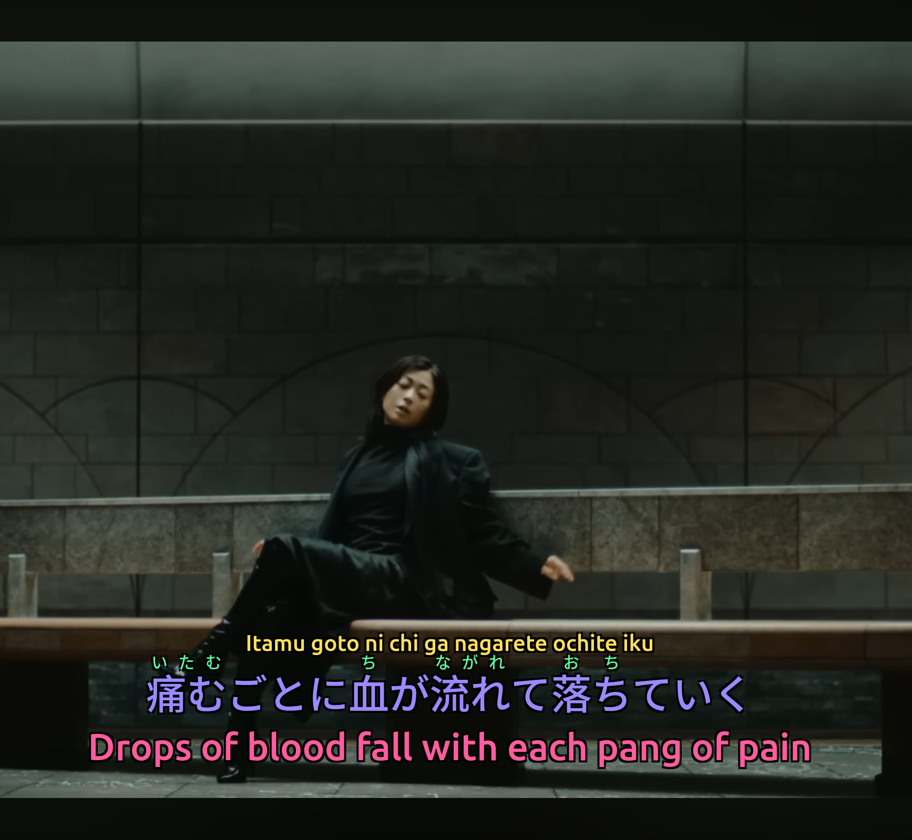
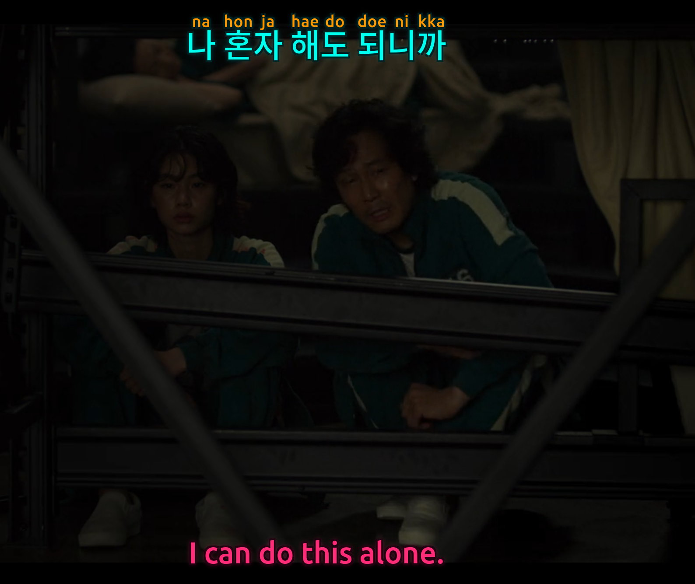
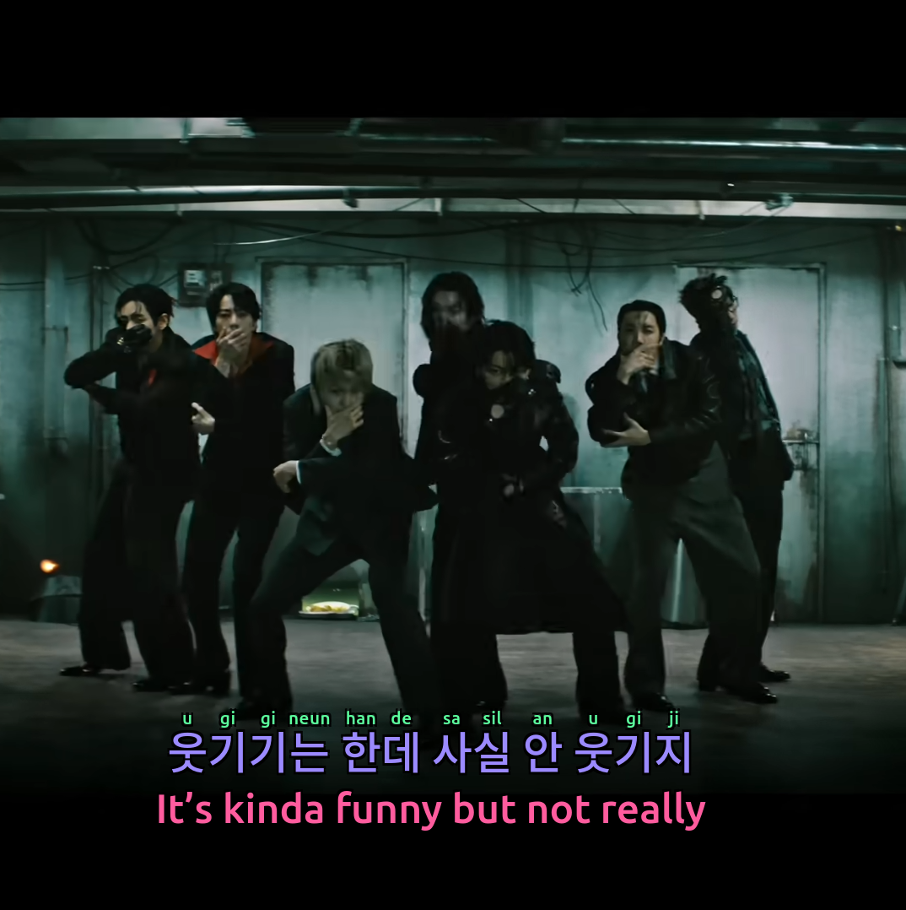

# Loom

**Watch foreign-language video with phonetic support that feels native — furigana above kanji, pinyin above hanzi, romanization above any script — on the things you already watch.**

Loom layers a target language, your native language, per-character readings, and a full phonetic line onto the same screen, the way Duolingo renders pinyin, but for real video. It runs as a **browser extension** on YouTube, Netflix, iQIYI and WeTV, as a **web app**, and as a **desktop app** — all over one shared language engine.

[**▶ Get the extension**](https://loom.nerv-analytic.ai/extension) · [Firefox add-on](https://addons.mozilla.org/en-US/firefox/addon/loom/) · [Chrome extension](https://chromewebstore.google.com/detail/loom/nhibbclhffbjfcbjihgcheojpellpkpj) · [Web app](https://loom.nerv-analytic.ai) · [Support / FAQ](https://loom.nerv-analytic.ai/support)



---

## What It Does

Take any video with a subtitle track in the language you're learning and Loom builds a stacked, reading-friendly display — four layers, top to bottom:

- **Romanization** — a phonetic reading of the whole line (macron Hepburn, pinyin, Revised Romanization…)
- **Per-character readings** — furigana above kanji, pinyin above hanzi, wherever the script supports it
- **Target language** — the spoken line
- **Your native language** — the translation

The ordering follows the interlinear-gloss convention used in linguistics — most phonetically accessible at the top, native script in the middle, translation at the bottom — so each reading sits directly above the characters it annotates. It's the same mental model as Duolingo's pinyin display, extended to a full four-layer stack and applied to whatever you're actually watching. You stay in the content instead of pausing to look words up.

Plain text can't reproduce the effect — the per-character alignment and color *are* the point — so here it is rendering live over real video. Everything below is generated by Loom, not the source:

### Japanese — furigana + romaji + translation

| | |
|---|---|
|  |  |

Furigana (`すくな` above `宿儺`) is sourced with a three-tier system that prefers the subtitle author's own readings; romaji is built from resolved kana with selectable long-vowel modes (`sōsaku` / `sousaku` / `sosaku`).

### Korean — Revised Romanization

| | |
|---|---|
|  |  |

The per-line romanization captures liaison, tensification and nasalization (`na hon ja hae do doe ni kka`), which a naive per-syllable transliteration would miss.

### Chinese — Pinyin, Zhuyin, and Simplified ⇄ Traditional

| | |
|---|---|
|  |  |

Tone-marked pinyin sits above each character. For Traditional content, Loom can additionally show the Simplified equivalent above unfamiliar characters (`為→为`, `來→来`, `這→这`) — a learning aid the alternate-orthography ruby provides for free.

---

## Where You Can Use It

| Surface | What it is | Status |
|---|---|---|
| **Browser extension** | Real-time overlay on **YouTube, Netflix, iQIYI, WeTV**. Per-tab activation, full styling, live track switching. | ✅ Live on [Firefox](https://addons.mozilla.org/en-US/firefox/addon/loom/) + [Chrome](https://chromewebstore.google.com/detail/loom/nhibbclhffbjfcbjihgcheojpellpkpj) |
| **Web app** | Upload subtitle tracks (or scan an MKV), generate a layered `.ass` / `.sup` file entirely in your browser. | ✅ [loom.nerv-analytic.ai](https://loom.nerv-analytic.ai) |
| **Desktop app** | Tauri build for local MKV workflows — scan, style, preview, generate, and remux. | ✅ Linux (`.deb` / `.rpm`); macOS / Windows planned |

All three call the same pure-Python language engine, so a reading that works in one works everywhere.

---

## Languages

Phonetic support is shipped end-to-end for every language below — both as **per-character annotation** (where the script supports it) and as a **full romanization line**.

| Language(s) | System(s) |
|---|---|
| **Chinese** | Pinyin (Simplified), Zhuyin/Bopomofo (Traditional), Jyutping (Cantonese) + Simplified⇄Traditional conversion |
| **Japanese** | Furigana + Hepburn romaji (macron / doubled / unmarked long-vowel modes) |
| **Korean** | Revised Romanization (per-syllable + liaison-aware word level) |
| **Cyrillic** | Russian, Ukrainian, Belarusian, Serbian, Bulgarian, Macedonian, Mongolian |
| **Thai** | Paiboon, RTGS, IPA |
| **Indic** | Hindi, Bengali, Tamil, Telugu, Gujarati, Punjabi |
| **Hebrew** | Consonantal transliteration |
| **Arabic / Persian / Urdu** | Learner + scholarly (DIN / DMG / ALA-LC) systems, with sun-letter assimilation and more |

### Romanization confidence

Not all romanization is equally certain, and Loom is honest about it — each language carries a confidence level in the UI.

| Confidence | Languages | Why |
|---|---|---|
| 🟢 Very high | Chinese (Pinyin) | 1:1 character mapping, fully standardized |
| 🟢 High | Korean, Cyrillic languages | Rule-based transliteration with well-defined standards |
| 🟡 Good | Japanese, Thai | Reliable for common vocabulary; occasional context-dependent readings |
| 🟡 Moderate | Indic scripts | Reliable, but multiple valid romanization schemes exist |
| 🟠 Lower | Arabic, Persian, Urdu | Abjad scripts omit short vowels — romanization is inherently incomplete |

---

## Annotation Quality

### Japanese furigana — three-tier sourcing

The furigana layer prefers the most trustworthy source available, in order:

1. **Author-annotated readings (ground truth).** Quality fansubs often write readings inline — `奴(やつ)`. The person who wrote the line knew the correct reading *in context*, which beats any automated guess for names, rare readings, and narrative-dependent readings. Loom detects this reserved typographic convention (hiragana-in-parentheses adjacent to kanji) with an effectively-zero false-positive rate.
2. **Pre-existing ASS ruby.** If the source track already carries positioned furigana, Loom defers to it.
3. **MeCab fallback.** For everything else, `fugashi`/MeCab with `unidic-lite` provides morpheme-level tokenization and readings.

### Japanese romaji — resolved-kana pipeline

Romaji is generated from *resolved kana*, not raw mixed text: extract author readings → MeCab fills gaps → merge (author wins) → pure kana → deterministic kana→romaji. This is more accurate than romanizing raw text directly, especially for unusual vocabulary and names. `ei` sequences are intentionally left un-macronized per strict Hepburn (先生 → *sensei*, not *sensē*).

### Language detection runs a character-level override first

Some characters are diagnostic: `ї є ґ` only exist in Ukrainian, `ў` only in Belarusian; Cantonese-specific characters (`係 喺 囉 咁 嘅`) distinguish Cantonese from Mandarin. Loom checks these before any probabilistic model, because misclassification doesn't just produce wrong output — it produces output under the *wrong standard*. Ukrainian is treated as Ukrainian, not Russian; Cantonese as Cantonese, not Mandarin.

---

## How It Works

**One engine, three front-ends.** All language logic lives in `loom_core` — a pure-Python package with no UI dependencies. A slim FastAPI service (`loom_api`) exposes it as text-in / text-out endpoints (`/romanize`, `/annotate`, plus batch variants), and the front-ends are thin clients over it.

- The **extension** acquires the subtitle track from the player, batches one request per language to the API on activation, then renders the layered overlay locally and goes quiet.
- The **web app** does the heavy media work — probe, extract, generate `.ass`/`.sup`, remux — entirely client-side with `ffmpeg.wasm`, and only sends short text to the API for romanization. That keeps hosting near-free and means your video never leaves your machine.
- The **desktop app** runs the same API as a local sidecar.

**Output is a real subtitle file.** The web and desktop paths produce a 3- or 4-layer `.ass` file and an optional `.sup` (PGS bitmap) — playable in VLC, mpv, or muxed straight into an MKV.

**Annotation is language-agnostic.** The renderer takes `(text, reading)` pairs and positions them; adding a new annotated script means adding a data source, not touching the layout. The same code stacks furigana above kanji, pinyin above hanzi, and akshara readings above Devanagari.

---

## Why This Exists

Learning through media is one of the most effective and enjoyable ways to build comprehension — but the tooling has always been fragmented. Watch with target-language subtitles and you stall on unknown vocabulary; watch with native subtitles and you lose the immersion. Duolingo nails the phonetic-annotation UX but only inside its own content.

Loom brings that UX to anything you watch. It started as a desktop prototype for anime with Japanese and Chinese fansub tracks; it's now a browser extension that does the same thing live on the streaming sites people actually use.

---

## How Is This Different From Aegisub / SubSync / Alass?

Those tools align, edit, or synchronize subtitles. Loom solves a different problem: **merging two tracks into a single layered file with phonetic annotation.** No existing subtitle tool takes a Japanese track and an English track and produces furigana above kanji, romaji above that, and a translation below — across 14+ languages, with author-reading detection and per-script confidence scoring. That annotation pipeline is the core of what Loom does, and you can't get it by combining existing tools.

---

## Tech Stack

- **Engine:** Python (`loom_core`) — `fugashi`/MeCab + `unidic-lite` (Japanese), `pypinyin` + `jieba` + `opencc` (Chinese), `korean-romanizer` (Korean), `cyrtranslit` (Cyrillic), `pythainlp` (Thai), `aksharamukha` (Indic), custom transliteration walkers (Hebrew / Arabic / Persian / Urdu), `pysubs2` (`.ass`).
- **API:** FastAPI + `slowapi`, deployed on Railway (`api.loom.nerv-analytic.ai`).
- **Web app:** Next.js + `ffmpeg.wasm`, deployed on Vercel.
- **Extension:** WXT + React (Manifest V2 / V3, Firefox + Chrome).
- **Desktop:** Tauri 2 + Vite + React, with the API as a sidecar.
- **Media:** `ffmpeg` for scan / extract / remux.

Subtitle input is detected by content, not extension: `.srt`, `.ass`, `.ssa`, `.vtt`, and more.

---

## Project Structure

```
loom_core/        # Pure language + subtitle engine (no UI). Single source of truth.
  romanize.py     #   All romanization systems
  language.py     #   Detection + Cantonese/Cyrillic discriminators
  styles.py       #   Per-language style + phonetic-system config
  subs/           #   .ass generation, preview, timing
  video/          #   ffmpeg scan / extract / remux / OCR
  rasterize/      #   PGS (.sup) bitmap output
loom_api/         # FastAPI service over loom_core (romanize / annotate / generate / mux)
apps/
  extension/      # WXT browser extension (YouTube / Netflix / iQIYI / WeTV)
  web/            # Next.js web app (client-side ffmpeg.wasm generation)
  desktop/        # Tauri desktop app
docs/images/      # README screenshots
tests/            # Engine test suite
```

---

## Running Locally

**Engine + API:**

```bash
pip install -r requirements.txt
uvicorn loom_api.web:app --reload --port 8000
```

**Web app:**

```bash
cd apps/web && npm install && npm run dev
```

**Extension (Firefox):**

```bash
cd apps/extension && npm install && npm run build:firefox
# then load .output/firefox-mv2/ via about:debugging → Load Temporary Add-on
```

`ffmpeg` must be on your `PATH` for the desktop/MKV flows.

**CJK font note:** for correct rendering of Japanese, Chinese, and Korean, install a CJK-capable font family — the free [Noto CJK](https://fonts.google.com/noto#702) fonts (Sans JP / SC / KR) are recommended and are Loom's defaults.

---

## Status

Loom is actively developed and shipping. The extension is public on Firefox and Chrome across four streaming platforms; the web app and desktop app are live; phonetic support covers 14+ languages end-to-end. Active work is UI internationalization (a localized settings panel, starting with Japanese) and an OCR pipeline for image-based subtitle tracks.

---

*Built for language learners, by someone learning languages.*
