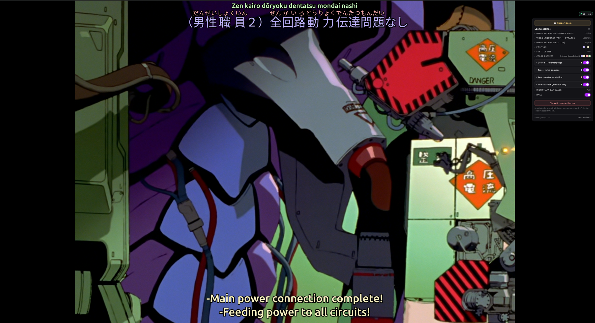
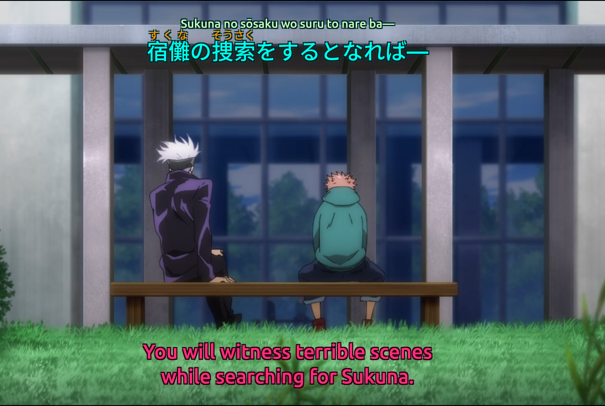
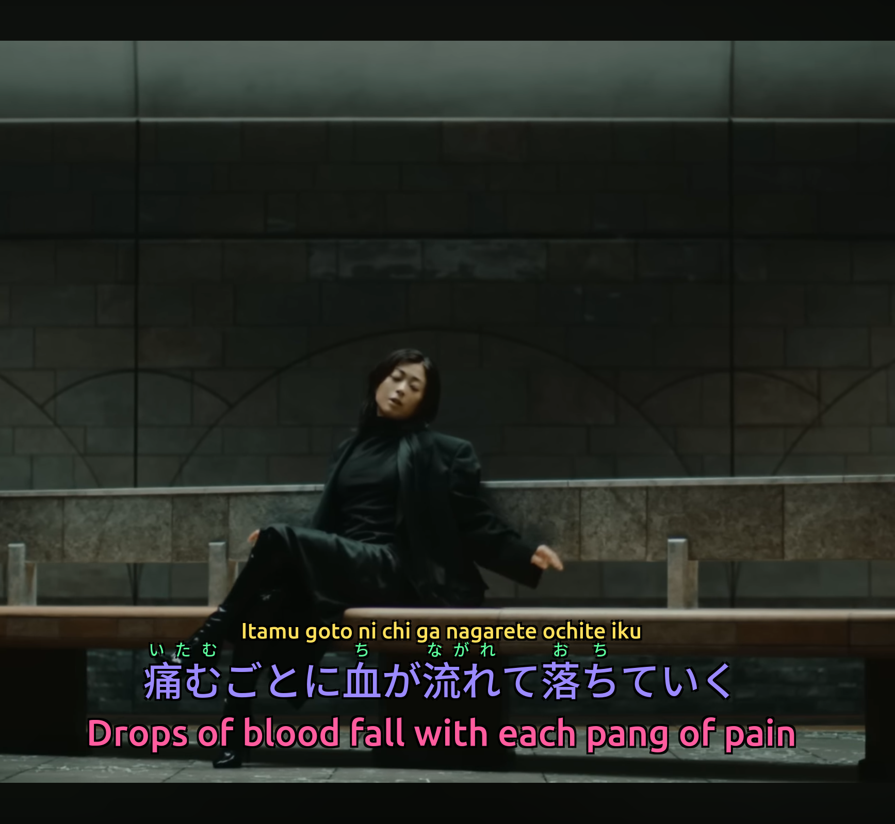
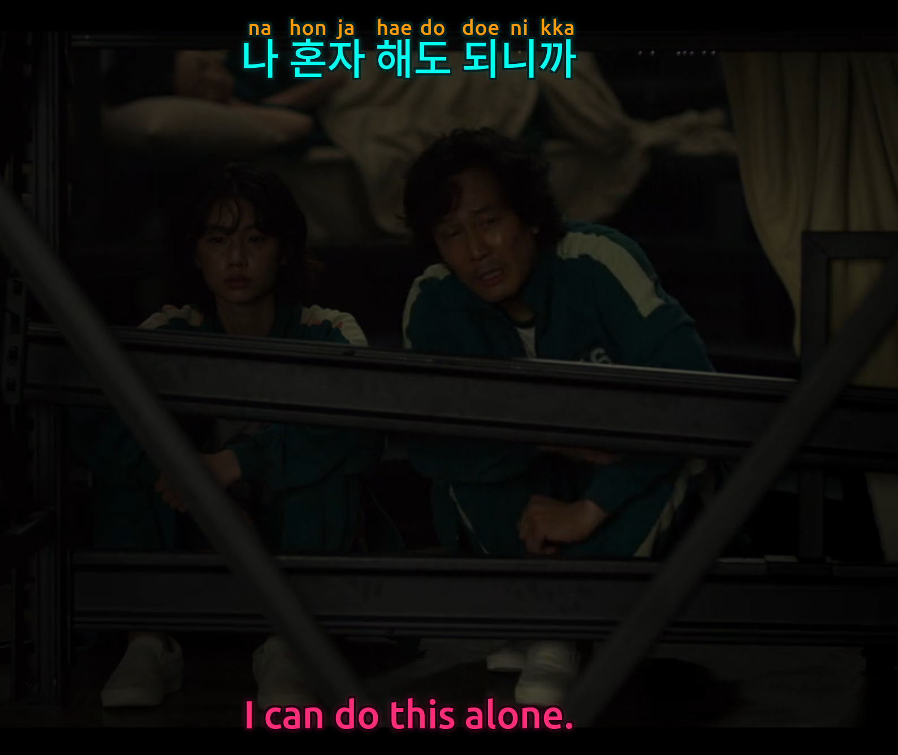
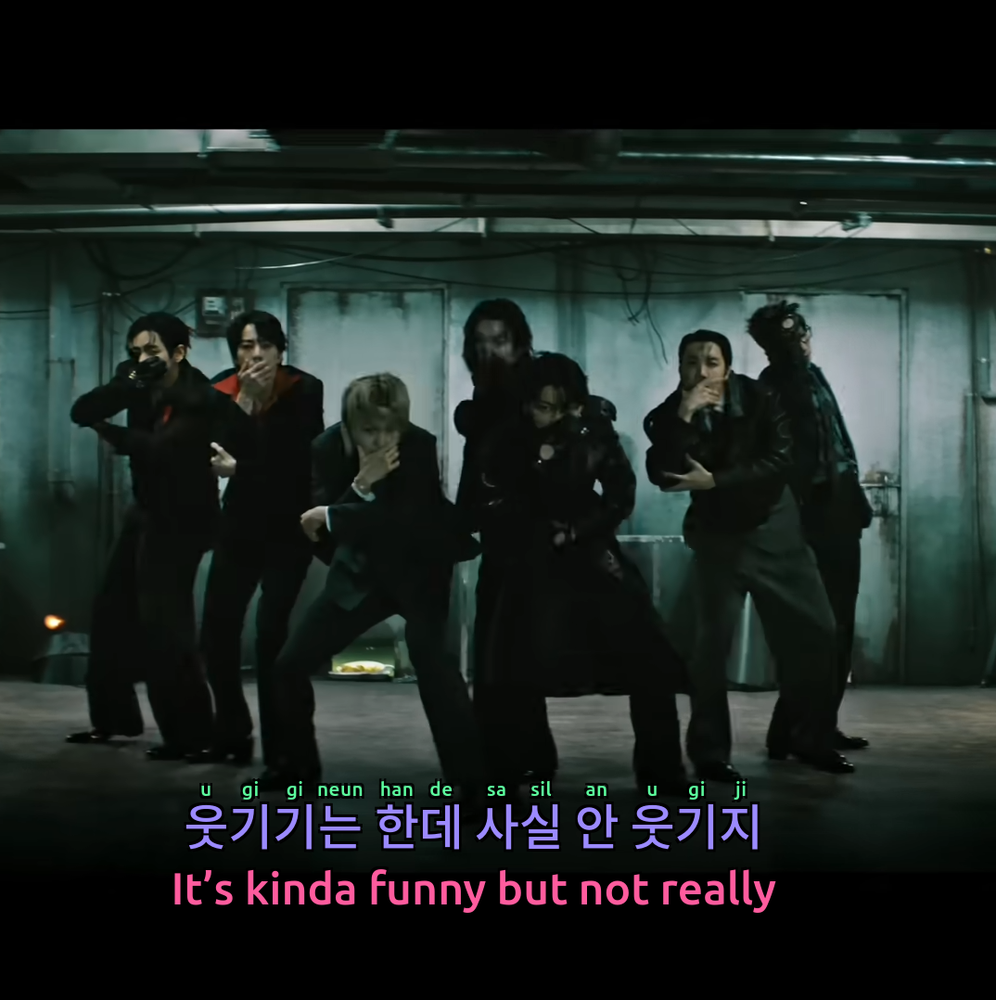
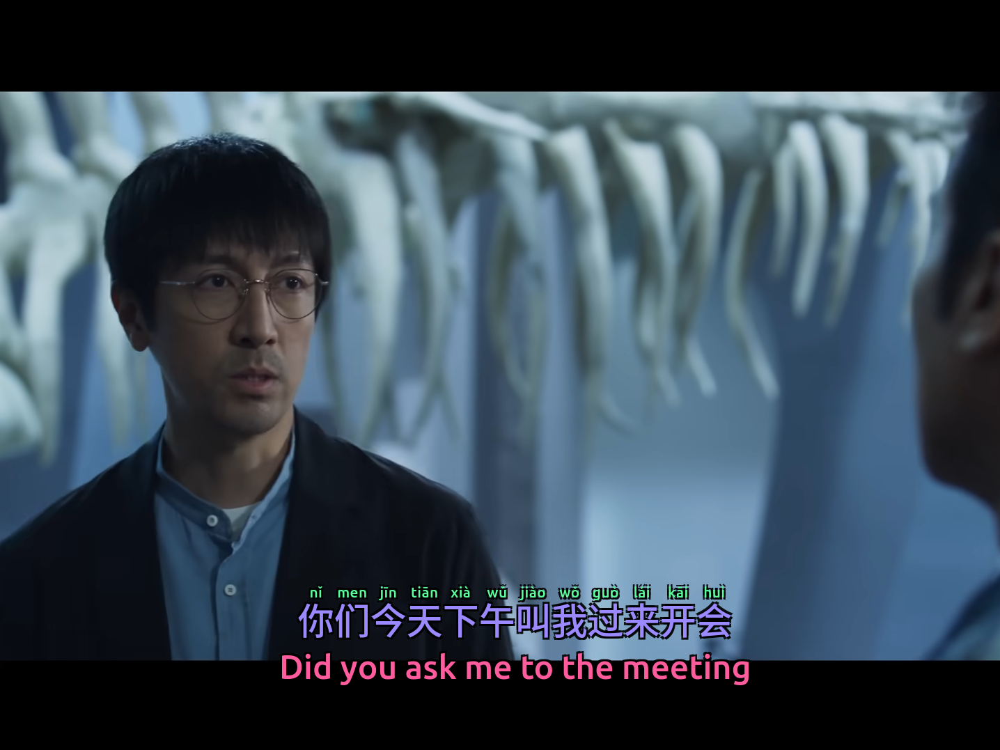
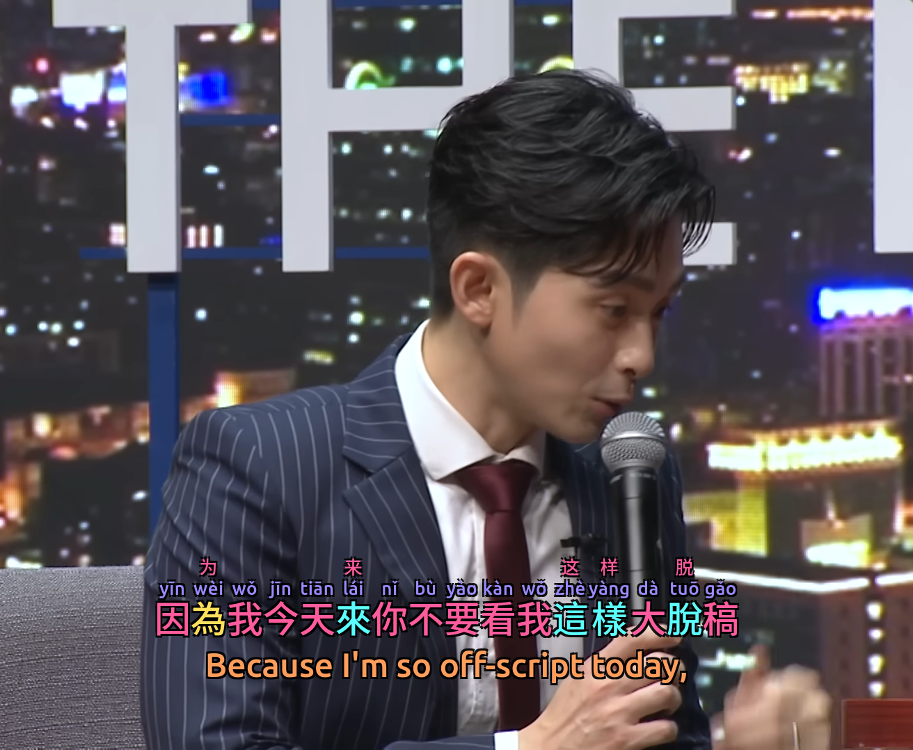
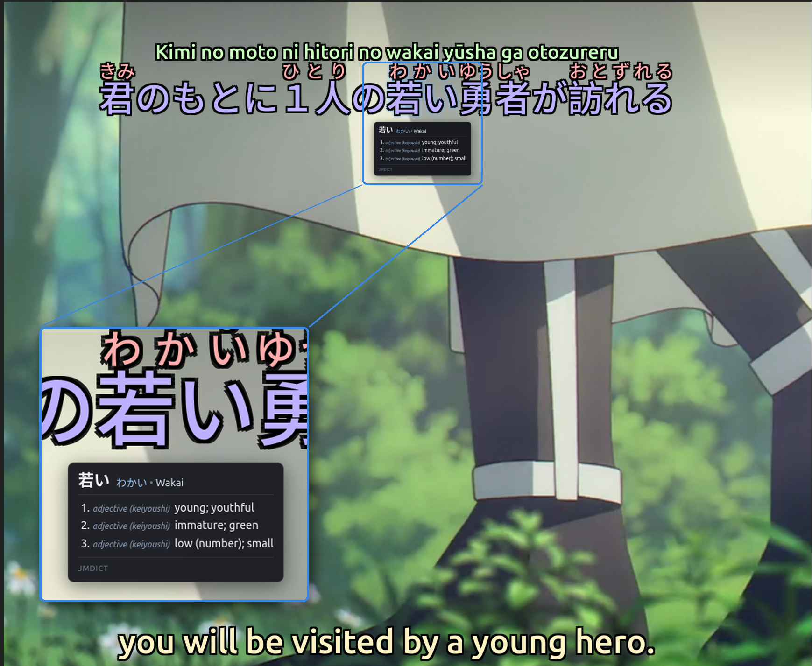
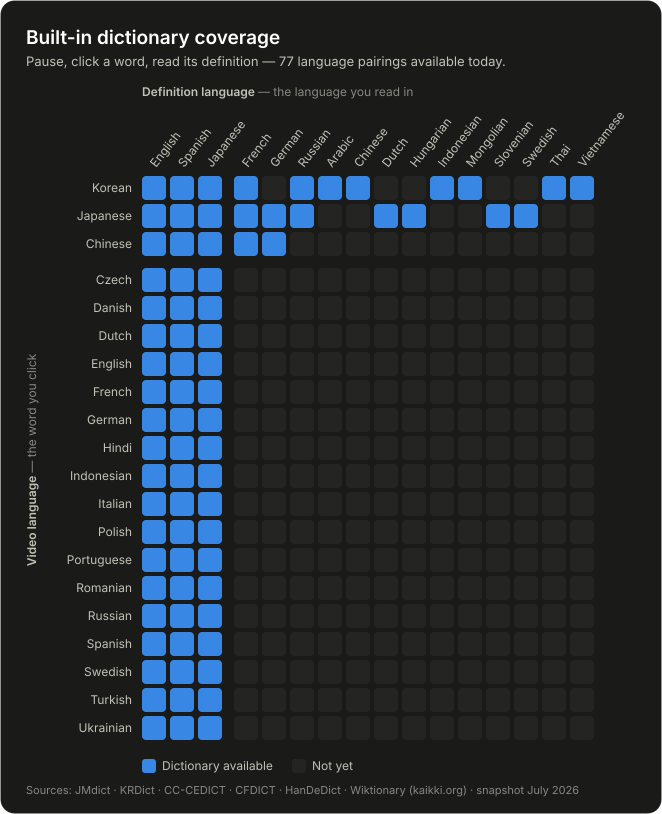
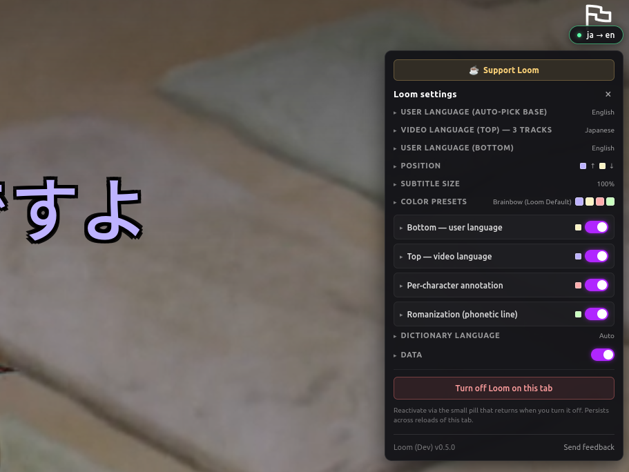

# Loom

**Watch foreign-language video with phonetic support that feels native — furigana above kanji, pinyin above hanzi, romanization above any script, and a click-to-define dictionary — on the things you already watch.**

Loom layers a target language, your native language, per-character readings, and a full phonetic line onto the same screen, the way Duolingo renders pinyin, but for real video. It runs as a **browser extension** on YouTube, Netflix, Prime Video, iQIYI and WeTV, as a **web app**, and as a **desktop app** — all over one shared language engine.

[**▶ Get the extension**](https://loom.nerv-analytic.ai/extension) · [Firefox add-on](https://addons.mozilla.org/en-US/firefox/addon/loom/) · [Chrome extension](https://chromewebstore.google.com/detail/loom/nhibbclhffbjfcbjihgcheojpellpkpj) · [Web app](https://loom.nerv-analytic.ai) · [Support / FAQ](https://loom.nerv-analytic.ai/support)



*Everything over the video is Loom: the romaji line, the furigana, the layered captions, the settings panel. Note the speaker label （男性職員２） — it stays on screen, but Loom knows it isn't dialogue and keeps it out of the romaji line and the dictionary.*

---

## What It Does

Take any video with a subtitle track in the language you're learning and Loom builds a stacked, reading-friendly display — four layers, top to bottom:

- **Romanization** — a phonetic reading of the whole line (macron Hepburn, pinyin, Revised Romanization…)
- **Per-character readings** — furigana above kanji, pinyin above hanzi, wherever the script supports it
- **Target language** — the spoken line
- **Your native language** — the translation

The ordering follows the interlinear-gloss convention used in linguistics — most phonetically accessible at the top, native script in the middle, translation at the bottom — so each reading sits directly above the characters it annotates. It's the same mental model as Duolingo's pinyin display, extended to a full four-layer stack and applied to whatever you're actually watching. And the target line is interactive: pause the video and every word becomes a dictionary lookup ([below](#click-any-word--built-in-dictionary)).

Plain text can't reproduce the effect — the per-character alignment and color *are* the point — so here it is rendering live over real video. Everything below is generated by Loom, not the source:

### Japanese — furigana + romaji + translation

| | |
|---|---|
|  |  |

Furigana (`すくな` above `宿儺`) is sourced with a three-tier system that prefers the subtitle author's own readings; romaji is built from resolved kana with selectable long-vowel modes (`sōsaku` / `sousaku` / `sosaku`).

### Korean — Revised Romanization

| | |
|---|---|
|  |  |

The per-line romanization captures liaison, tensification and nasalization (`na hon ja hae do doe ni kka`), which a naive per-syllable transliteration would miss.

### Chinese — Pinyin, Zhuyin, and Simplified ⇄ Traditional

| | |
|---|---|
|  |  |

Tone-marked pinyin sits above each character. For Traditional content, Loom can additionally show the Simplified equivalent above unfamiliar characters (`為→为`, `來→来`, `這→这`) — a learning aid the alternate-orthography ruby provides for free.

---

## Click Any Word — Built-In Dictionary

Pause the video and the target line becomes interactive: hover a word and it glows, click it and a definition card opens right where you're looking —



The card shows the word's reading, its romanization, dictionary senses with part-of-speech tags, and the dictionary they came from. No tab switching, no flashcard app on the side — the lookup happens inside the moment that made you curious.

Three details make it work like a tool rather than a demo:

- **Lookups are morphology-aware.** Click 食べさせられた and Loom resolves it to 食べる before looking anything up. Conjugated verbs, polite forms (聞こえてます → 聞こえる), Korean endings (먹었어요 → 먹다), and measure-word compounds all land on the right entry instead of dead-ending.
- **Inflected words get a grammar breakdown.** Beyond what a word *means*, the card explains what it's *doing*: 食べさせられた → **食べる** (to eat) · causative · passive · past. Japanese and Korean use live morphological analysis; Hindi, Spanish, French, German, Russian and roughly ten more get the same from Wiktionary's inflection data (करते → करना · habitual participle; comieron → comer · preterite).
- **Definitions come in your language, not just English.** A "Dictionary language" picker — in the card and in settings — switches the language definitions are written in, wherever a dictionary exists for the pair.

### Coverage



Roughly nine million entries, built entirely from open dictionaries — **JMdict** (Japanese), **CC-CEDICT / CFDICT / HanDeDict** (Chinese), **KRDict** (Korean), and **Wiktionary** via kaikki.org for everything else — all CC-BY-SA, credited on every card. Coverage is declared by the server (`/define/capabilities`), so a newly ingested dictionary lights up in the extension without a store update.

---

## The Interface



Every layer is its own card — toggle, color, font, size, opacity, outline, glow — with 28 language-aware color presets when you'd rather not design it yourself. Position, subtitle scale, and vertical nudge are remembered **per platform**, so your Netflix setup doesn't fight your YouTube setup.

- **Dormant until asked.** Every tab starts as a small pill; you activate Loom per tab, and a global switch turns it (and all caption observation) off entirely.
- **Track-aware.** Live track switching mid-playback, auto-pick keyed to the title's audio language, and a single-line mode for media that only carries one track.
- **Localized.** The whole interface — popup, settings, definition card — ships in 12 languages, following your browser's language.

---

## Where You Can Use It

| Surface | What it is | Status |
|---|---|---|
| **Browser extension** | Real-time overlay on **YouTube, Netflix, Prime Video, iQIYI, WeTV**. Per-tab activation, full styling, live track switching, click-to-define dictionary. | ✅ Live on [Firefox](https://addons.mozilla.org/en-US/firefox/addon/loom/) + [Chrome](https://chromewebstore.google.com/detail/loom/nhibbclhffbjfcbjihgcheojpellpkpj) |
| **Web app** | Upload subtitle tracks (or scan an MKV), generate a layered `.ass` / `.sup` file entirely in your browser. | ✅ [loom.nerv-analytic.ai](https://loom.nerv-analytic.ai) |
| **Desktop app** | Tauri build for local MKV workflows — scan, style, preview, generate, and remux. | ✅ Linux (`.deb` / `.rpm`); macOS / Windows planned |

All three call the same pure-Python language engine, so a reading that works in one works everywhere.

---

## Languages

Phonetic support is shipped end-to-end for every language below — both as **per-character annotation** (where the script supports it) and as a **full romanization line**.

| Language(s) | System(s) |
|---|---|
| **Chinese** | Pinyin (Simplified), Zhuyin/Bopomofo (Traditional), Jyutping (Cantonese) + Simplified⇄Traditional conversion |
| **Japanese** | Furigana + Hepburn romaji (macron / doubled / unmarked long-vowel modes) |
| **Korean** | Revised Romanization (per-syllable + liaison-aware word level) |
| **Cyrillic** | Russian, Ukrainian, Belarusian, Serbian, Bulgarian, Macedonian, Mongolian |
| **Thai** | Paiboon, RTGS, IPA |
| **Indic** | Hindi, Bengali, Tamil, Telugu, Gujarati, Punjabi |
| **Hebrew** | Consonantal transliteration |
| **Arabic / Persian / Urdu** | Learner + scholarly (DIN / DMG / ALA-LC) systems, with sun-letter assimilation and more |

Phonetic annotation and dictionary lookup are independent capabilities: the [dictionary matrix](#coverage) adds most major European languages, and a language can have either or both (Japanese has both; Spanish is dictionary-only; Thai is phonetic-only — for now).

### Romanization confidence

Not all romanization is equally certain, and Loom is honest about it — each language carries a confidence level in the UI.

| Confidence | Languages | Why |
|---|---|---|
| 🟢 Very high | Chinese (Pinyin) | 1:1 character mapping, fully standardized |
| 🟢 High | Korean, Cyrillic languages | Rule-based transliteration with well-defined standards |
| 🟡 Good | Japanese, Thai | Reliable for common vocabulary; occasional context-dependent readings |
| 🟡 Moderate | Indic scripts | Reliable, but multiple valid romanization schemes exist |
| 🟠 Lower | Arabic, Persian, Urdu | Abjad scripts omit short vowels — romanization is inherently incomplete |

---

## Annotation Quality

### Japanese furigana — three-tier sourcing

The furigana layer prefers the most trustworthy source available, in order:

1. **Author-annotated readings (ground truth).** Quality fansubs often write readings inline — `奴(やつ)`. The person who wrote the line knew the correct reading *in context*, which beats any automated guess for names, rare readings, and narrative-dependent readings. Loom detects this reserved typographic convention (hiragana-in-parentheses adjacent to kanji) with an effectively-zero false-positive rate.
2. **Pre-existing ASS ruby.** If the source track already carries positioned furigana, Loom defers to it.
3. **MeCab fallback.** For everything else, `fugashi`/MeCab with `unidic-lite` provides morpheme-level tokenization and readings.

### Japanese romaji — resolved-kana pipeline

Romaji is generated from *resolved kana*, not raw mixed text: extract author readings → MeCab fills gaps → merge (author wins) → pure kana → deterministic kana→romaji. This is more accurate than romanizing raw text directly, especially for unusual vocabulary and names. `ei` sequences are intentionally left un-macronized per strict Hepburn (先生 → *sensei*, not *sensē*).

### Language detection runs a character-level override first

Some characters are diagnostic: `ї є ґ` only exist in Ukrainian, `ў` only in Belarusian; Cantonese-specific characters (`係 喺 囉 咁 嘅`) distinguish Cantonese from Mandarin. Loom checks these before any probabilistic model, because misclassification doesn't just produce wrong output — it produces output under the *wrong standard*. Ukrainian is treated as Ukrainian, not Russian; Cantonese as Cantonese, not Mandarin.

### Subtitle furniture is display-only

Real subtitle tracks are full of things that aren't dialogue: speaker labels （フリーレン）, multi-speaker turn dashes, SFX brackets. Measured over a ~30,000-cue corpus of real anime and drama tracks, over a third of Japanese cues open with one. Loom keeps them on screen — it never destroys information — but excludes them from romanization and word lookup, so a character's name is never romanized mid-line or offered as a clickable "word."

---

## How It Works

**One engine, three front-ends.** All language logic lives in `loom_core` — a pure-Python package with no UI dependencies. A slim FastAPI service (`loom_api`) exposes it as text-in / text-out endpoints (`/romanize`, `/annotate`, `/define`, plus batch variants), and the front-ends are thin clients over it.

- The **extension** acquires the subtitle track from the player, batches one request per language to the API on activation, then renders the layered overlay locally and goes quiet. Definitions are fetched per click.
- The **web app** does the heavy media work — probe, extract, generate `.ass`/`.sup`, remux — entirely client-side with `ffmpeg.wasm`, and only sends short text to the API for romanization. That keeps hosting near-free and means your video never leaves your machine.
- The **desktop app** runs the same API as a local sidecar.

**Results are computed once, ever.** A content-addressed Postgres cache sits behind the batch endpoints, so a popular episode's romanization is shared by everyone who watches it after the first person.

**Output is a real subtitle file.** The web and desktop paths produce a 3- or 4-layer `.ass` file and an optional `.sup` (PGS bitmap) — playable in VLC, mpv, or muxed straight into an MKV.

**Annotation is language-agnostic.** The renderer takes `(text, reading)` pairs and positions them; adding a new annotated script means adding a data source, not touching the layout. The same code stacks furigana above kanji, pinyin above hanzi, and akshara readings above Devanagari. The dictionary works the same way: adding a language is a server-side ingest, gated by a corpus quality harness, with no client change.

---

## Why This Exists

Learning through media is one of the most effective and enjoyable ways to build comprehension — but the tooling has always been fragmented. Watch with target-language subtitles and you stall on unknown vocabulary; watch with native subtitles and you lose the immersion. Duolingo nails the phonetic-annotation UX but only inside its own content.

Loom brings that UX to anything you watch. It started as a desktop prototype for anime with Japanese and Chinese fansub tracks; it's now a browser extension that does the same thing live on the streaming sites people actually use — and looks up the words you click while you're there.

---

## How Is This Different From Aegisub / SubSync / Alass?

Those tools align, edit, or synchronize subtitles. Loom solves a different problem: **merging two tracks into a single layered display with phonetic annotation and an integrated dictionary.** No existing subtitle tool takes a Japanese track and an English track and produces furigana above kanji, romaji above that, a translation below, and a morphology-aware definition card on click — across 14+ languages, with author-reading detection and per-script confidence scoring. That pipeline is the core of what Loom does, and you can't get it by combining existing tools.

---

## Tech Stack

- **Engine:** Python (`loom_core`) — `fugashi`/MeCab + `unidic-lite` (Japanese), `pypinyin` + `jieba` + `opencc` (Chinese), `kiwipiepy` + `korean-romanizer` (Korean), `cyrtranslit` (Cyrillic), `pythainlp` (Thai), `aksharamukha` (Indic), `simplemma` (lemmatization for the generic word path), custom transliteration walkers (Hebrew / Arabic / Persian / Urdu), `pysubs2` (`.ass`).
- **API:** FastAPI on Railway (`api.loom.nerv-analytic.ai`), with Postgres backing the ~9M-entry dictionary store and the content-addressed result cache.
- **Web app:** Next.js + `ffmpeg.wasm`, deployed on Vercel.
- **Extension:** WXT + React (Manifest V2 / V3, Firefox + Chrome).
- **Desktop:** Tauri 2 + Vite + React, with the API as a sidecar.
- **Media:** `ffmpeg` for scan / extract / remux.

Subtitle input is detected by content, not extension: `.srt`, `.ass`, `.ssa`, `.vtt`, and more.

---

## Project Structure

```
loom_core/        # Pure language + subtitle engine (no UI). Single source of truth.
  romanize.py     #   All romanization systems + word tokenization
  grammar.py      #   Inflection analysis (JA/KO morphology + Wiktionary form-of)
  language.py     #   Detection + Cantonese/Cyrillic discriminators
  styles.py       #   Per-language style + phonetic-system config
  subs/           #   .ass generation, preview, timing
  video/          #   ffmpeg scan / extract / remux / OCR
  rasterize/      #   PGS (.sup) bitmap output
loom_api/         # FastAPI service over loom_core (romanize / annotate / define / generate / mux)
apps/
  extension/      # WXT browser extension (YouTube / Netflix / Prime Video / iQIYI / WeTV)
  web/            # Next.js web app (client-side ffmpeg.wasm generation)
  desktop/        # Tauri desktop app
packages/         # Shared TypeScript packages (@loom/api-client, @loom/player-ui, …)
scripts/          # Dictionary ingest, quality harness, corpus export
docs/images/      # README screenshots
tests/            # Engine test suite
```

---

## Running Locally

**Engine + API:**

```bash
pip install -r requirements.txt
uvicorn loom_api.web:app --reload --port 8000
```

**Web app:**

```bash
cd apps/web && npm install && npm run dev
```

**Extension (Firefox):**

```bash
cd apps/extension && npm install && npm run build:firefox
# then load .output/firefox-mv2/ via about:debugging → Load Temporary Add-on
```

`ffmpeg` must be on your `PATH` for the desktop/MKV flows.

**CJK font note:** for correct rendering of Japanese, Chinese, and Korean, install a CJK-capable font family — the free [Noto CJK](https://fonts.google.com/noto#702) fonts (Sans JP / SC / KR) are recommended and are Loom's defaults.

---

## Status

Loom is actively developed and shipping. The extension is public on Firefox and Chrome across five streaming platforms; the web app and desktop app are live; phonetic support covers 14+ languages end-to-end, the built-in dictionary covers 20, and the interface is localized into 12. Active work: **Loom Player** — a native desktop player (libmpv) bringing the same stack, dictionary included, to local `.mkv` files — and an OCR pipeline for image-based subtitle tracks.

---

*Built for language learners, by someone learning languages.*
